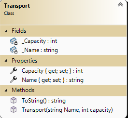

# In Class Assessment 1 - Classes, Objects, and Composition

## Coding Problem

## Overview 

Your task is to generate a set of developer defined data types to represent the primary objects for managing a tour list.

A .NET Solution file with a class library project and an xUnit test project has already been provided to you and can be found in the **`src`** folder. Use this solution when providing your answers for this assessment. Do **not** create your own solutions or projects for this assessment. Your work **must** be submitted within **this** repository and pushed to github.com.

In this assessment, you are required to demonstrate your ability to:

- Code C# classes complete with properties, fields, constructors, and/or methods
- Ensure proper functionality of your classes/objects by use of exceptions for invalid inputs
- Prove the validity of your solution through unit tests

### Use Frequent Commits

Commit your work at the end of each and every **Activity**. ***Mark(s) may be deducted based on the commit activity in your repository.*** Ensure you sync your local clone to GitHub before the end of class. The classroom assessment ends at the end of class period. **It is your responsibility to ensure your work is properly submitted. Failure to submit your work may result in deductions up to and including a final mark of 0 (zero) for this assessment.**

Build and Run your work periodically, and `commit` frequently.

### General Validation Rules

All validation is to be performed by throwing exceptions. Here are some general requirements.

- Exceptions must have meaningful error messages.
  - use `ArgumentNullException` for missing data values
  - use `ArgumentException` for invalid values (Error messages must include the invalid value and a suggestion for a correct value).
- All string information must contain text. Null, empty, and plain white-space text is not allowed. Sanitize your strings by trimming the leading and trailing whitespace.
  
### Unit Testing

Create your unit tests within the appropriate file supplied for you in the **xUnit Testing** project. Use FluentAssertions for your unit tests. Create meaningful names for your unit test methods. Do not create an exhaustive test suite; ***only the requested unit tests need to be coded.***

## Activity 1

### The `Destination` class

A file has been created called `Destination.cs` in the project. Code a class definition creating a class called `Destination` that has two fully-implemented properties (with public get and set):

- property: a `string` called `Location` (could be a City, country, busines, etc.)
- property: a `DateTime` called `VisitDate` (date of visit)
- a greedy constructor
- a `ToString()` method to return the Destination's data, as a comma delimited string (no additional spaces). Order data to match constructor input. Date should be in the format of `MMM dd yyyy`.

Data will be validated within their respective properties. `Location` must have a value. `VisitDate` must be a date that is today or in the future.

### The xUnit Testing : `Destination_Should`

Create the following unit tests within the file in the supplied **xUnit Testing** project. Use FluentAssertions for your unit tests. ***Only the requested unit tests need to be coded.***

Prove the validity of your `Destination` class by writing tests for the following:

- Test that the `Location` and `VisitDate` data has been successfully stored to its property when creating a new instance. Validate each property return value **and** the ToString value.
- Test that an appropriate exception is throw when `Location` has missing data when creating a new instance. 

------

**Remember:** When you are finished **each** activity that you commit the work.

------

## Activity 2

### The `Transport`

A file has been created called `Transport.cs` in the project. The class definition `Transport` has two fully- implemented public properties (public get/set):

- a `string` field called `Name` (could be a Company name, ship name, busines name, etc.)
- an `integer` field called `Capacity`
- a greedy constructor
- a `ToString()` method to return the Transport's data, as a comma delimited string (no additional spaces). Order data to match constructor input.

Data will be validated within the properties. `Name` must have a value. `Capacity` must be a non-zero positive value.

### The xUnit Testing : `Transport_Should`

Create the following unit tests within the file in the supplied **xUnit Testing** project. Use FluentAssertions for your unit tests. ***Only the requested unit tests need to be coded.***

Prove the validity of your `Transport` class by writing tests for the following:

- Test that the `Name` data has been successfully stored to its property when changing the `Name` via its property directly.
- Test that an appropriate exception is throw when `Capacity` has invalid data when creating a new instance. Check the exception message contains the invalid value.

------

**Remember:** When you are finished **each** activity that you commit the work.

------

|  Weight   |      Deliverable       |
| :------:  | :--------------------: |
|    3     |   Activity 1 Destination class   |
|    3     | Activity 1  Unit Tests |
|    3     |    Activity 2 Transport class  |
|    3     |  Activity 2 Unit Tests |
|   ----   |       ----------      |
|    12    |         Total         |

------

When you are finished make sure to `push` your code to `your github remote assessment repository`.

