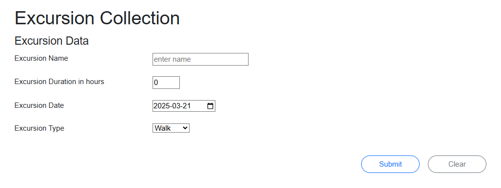

# In Class Assessment 2 - Blazor Pages Web Application 

## Overview
In this asseessment you will alter an ASP.NET Core Web App using Blazor Pages to collect tour data and display the collected data.

A starter kit has been supplied for you. **You must code your answer in the supplied solution**. It contains:

1. A folder called **Data** to hold the csv text files. One file is for good data, one file is empty, and the last file holds a mixture of good and bad data for testing your code.
2. A folder called **Model** with a class called **Excursion** and an enum called **ExcursionType**. Excursion has a **.ToString()** method that will produce the record layout for the csv text file. It also contains a static method to parse a csv record into an instance of Excursion. **Do Not modify this class.**

You will modify 2 existing Blazor Pages:
1. `ExcursionCollection` will collect data and `append` the data to a csv text file.
2. `ExcursionSchedule` will read a csv text file and display the data within in a tabular view.

### Use Frequent Commits

Commit your work at the end of each and every **Activity**. Make it clear which activity a commit is for in the commit message.

***Mark(s) may be deducted based on the commit activity in your repository.***

Ensure you sync your local clone to GitHub before the end of class. The classroom assessment ends at the end of class period.

**It is your responsibility to ensure your work is coded in the supplied solution and properly submitted. It is your repsonsibiltiy to ensure your work is properly submitted. Failure to submit your work as requested may result in deductions up to and including a final mark of 0 (zero) for this assessment.**

## Requirements

## Activity 1
### Home.razor

Modify the existing `h4` heading in the `Home.razor` file with **your** full name.

## Activity 2
### ExcursionSchedule Tabular Report component

Modify the Blazor Page named `ExcursionSchedule.razor`. Write code to:
1. Display the data of a csv text file in a tabular display.
2. Read a csv text file filled with tour excursion data.

An area to display a summary of errors has already been placed on the page. 

### Examples

.

.

 >   1. Display all fields of the Excursion instance.
 >   2. Display an unique message if: 
 >       -  the csv text file is not present
 >       -  the csv text file is empty.
 >   3. Process **all** records in the file.
 >   4. Display a message if the csv text record has a format or other thrown error.

## Activity 3
### ExcursionCollection component 

Modify the Blazor component named `ExcursionCollection.razor`. Write the code to:

1. Create the mockup form image shown below. **Do not** use `EditForm`.
2. Validate all data. This should be done in the event method.
3. Add any necessary properties/variables to the page for your form.
4. Collect and display **all** possible errors at one time. An area to display a summary of errors has already been placed on the page. 
5. Append the data to the good csv file located in the `Data` folder if the data passes validation.

### Example

**The page does not need to match the given layout BUT all controls must be present.**

>    1. The *Name* text field allows the user to enter the execursion name.
>    2. The *Excursion Date* date field allows the user to enter the excursion date (**default to today's date on the form**)
>    3. The *Excursion Duration* number field allows the user to enter the duration time in hours.
>    4. The *Excursion Type* allows the user to select a excursion type. This list can be retreived from the enum class `ExcursionType`.
>    5. The *Collection* button will submit the page. Use to collect the data, validate and append to a csv text file. 
>    6. The *Clear* button will set the page fields to their opening (starting) state. The button will prompt the user to continue with a warning about losing entered data.

### Validation

> 1. Name must be present.
> 2. Duration must be non zero positive value.
> 3. Date cannot be in the past (today is acceptable).

----

## Evaluation

----

| Weight |  Deliverable |
| :----: |  :----------: |
| 3 |  Data collection Form |
| 3 |  Data collection Save Event |
| 1 |  Data collection Clear Event |
| 2 |  Report Tabular Display |
| 2 |  Report Event code to read file and handle record errors |
| 2 |  Appropriate commits have been made to reflex incremental development. |
| ---- | ---- |
| 13 |  Total |

### Marking Rubric

| Weight | Breakdown |
| ----- | --------- |
| **1** | 1 = Proficient (requirements are met; meets all class standards; contains acceptable coding structures) 0 = Incomplete (requirements not met; missing large portions/requirements; major errors; class standards not meet; contains unacceptable coding structures) |
| **2** | 2 = Proficient (requirements are met; meets all class standards; contains acceptable coding structures) 1 = Limited (requirements adequately met; missing some minor portions; minor errors, class standards not meet; contains unacceptable coding structures) 0 = Incomplete (requirements not met or missing large portions; major errors; class standards not followed; contains unacceptable coding structures) |
| **3** | 3 = Proficient (requirements are met; meets all class standards, contains acceptable coding structures) 2 = Capable (requirements are adequately met; minor errors; class standards not meet; contains unacceptable coding structures) 1 = Limited (requirements are partially met; major errors; class standards not meet; contains unacceptable coding structures) 0 = Incomplete (requirements not met or missing large portions; major errors; class standards not meet; contains unacceptable coding structures) |
